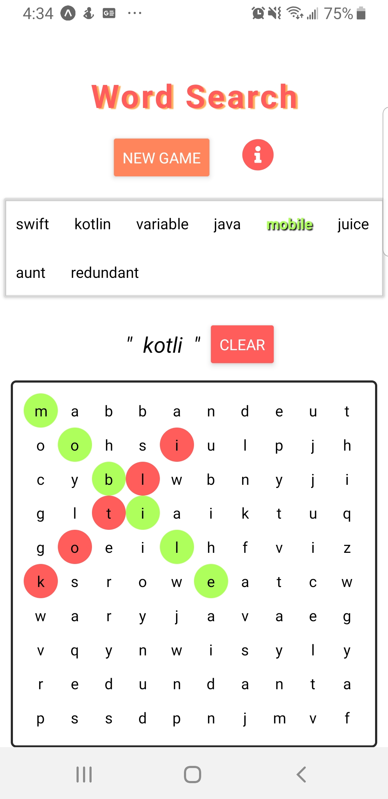

# WordSearch
Word Search challenge for Shopify

## Instructions
1. Download the repository from github to a local folder. 
2. You will need to download expo using npm. 
3. run 'npm install' to install dependencies
4. run 'expo start' and view the app on Android or Iphone using the expo app from the Play Store and App Store respectively

## File Structure
To maintain game state, the app nests a word search board (Board.js) inside of a game (Game.js). The App.js file handles the redux logic. 
My project combines both state and Redux props to make a functioning, cohesive game. 

## How to Play
Tap individual letters to make a selection. Words that are found will appear green in the word bank. Once all words are found, you win!
Press New game to generate a board.
The dictionary used and the size of the board can be modified (in Board.js). Since this was meant to be a quick project, the functionality may be a little buggy

## Screenshot

